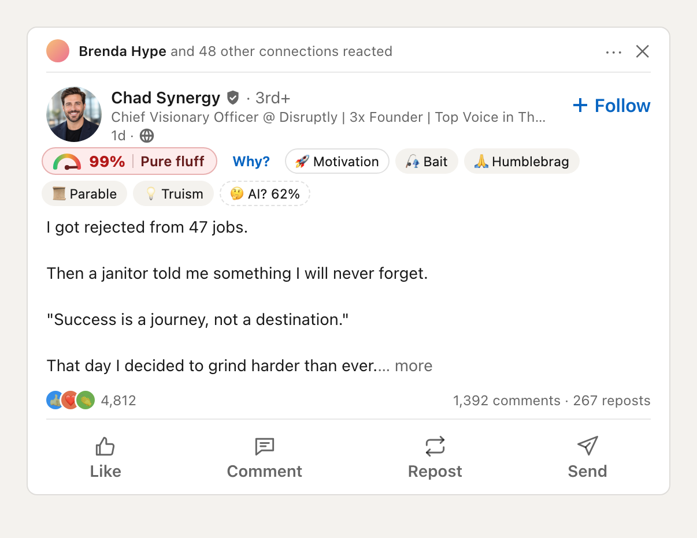
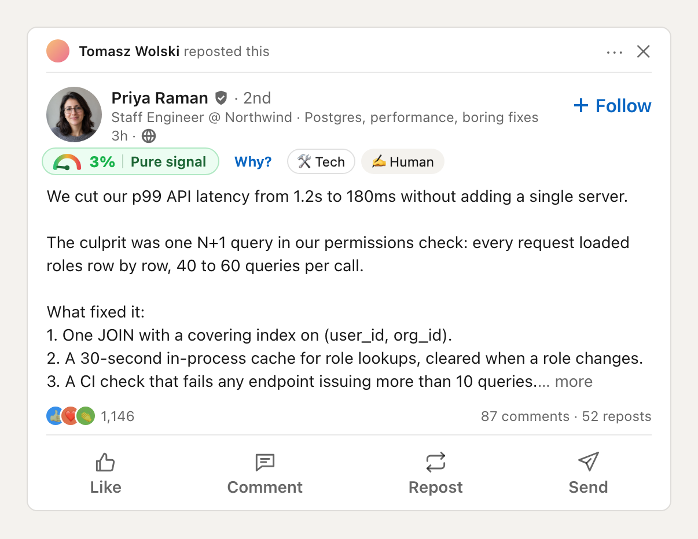
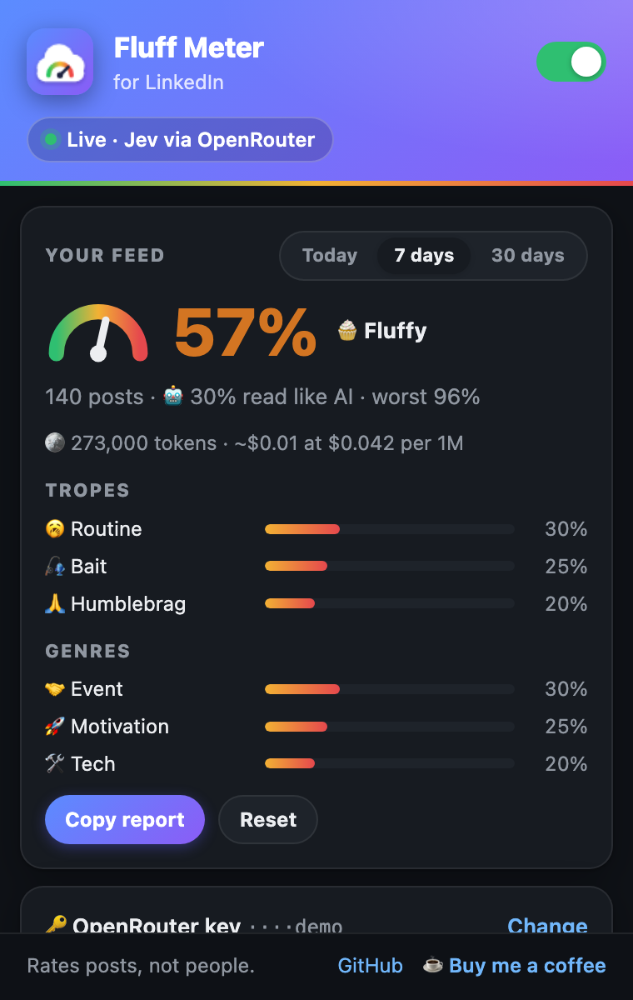

# Fluff Meter

**Rates every LinkedIn post on a 0–100% Fluff Index.**

The same feed, two posts: a janitor parable and a real fix with numbers.

Scroll LinkedIn as usual. Every post gets a small badge that tells you:

- **how much fluff it is**, from 🧠 *Pure signal* to ☁️ *Pure fluff*;
- **whether it reads like AI wrote it**;
- **what kind of post it is**: tech, hiring, career news, motivation, promo…;
- **which clichés it uses**: humblebrags, "Agree? 👇", janitor stories, one-line-per-sentence
  "broetry".

The popup shows how much of your feed was fluff today, this week or this month.

It rates posts, not people.

## Install

1. Download the zip from the [latest release](https://github.com/horbel/fluff-meter/releases/latest)
   and unzip it.
2. Open `chrome://extensions`, turn on **Developer mode**, click **Load unpacked** and pick the
   unzipped folder.
3. Open LinkedIn.

It starts in **demo mode** with random numbers, so you can see how it looks. For real scores,
click the extension icon and paste a [TypeSafe](https://console.typesafe.ai/keys) or
[OpenRouter](https://openrouter.ai/settings/keys) API key. $1 covers about 12,000 posts.

## Make it yours

Every tag has a slider from 🏆 (fine by me) to ☁️ (pure fluff). Think event posts are
nonsense? Drag *Event* to ☁️. Or pick a preset: **Engineer**, **Recruiter** or **Pragmatist**.

## Privacy

No servers, no tracking. Without a key nothing leaves your browser. With a key, only the text of
the posts you scroll past goes to the AI provider you picked. [Details](PRIVACY.md).

 

## For developers

- [How it works](docs/how-it-works.md): the model, the scoring and the code layout.
- [Contributing](CONTRIBUTING.md): setup, tests and where to fix things when LinkedIn changes.
- [Chrome Web Store listing](docs/chrome-web-store.md): texts and answers for publishing.

Scores come from [Jev](https://docs.typesafe.ai/concepts/system-one), a small, fast model by
TypeSafe that answers yes/no and multiple-choice questions instead of writing text.

## Support

If it made you laugh at your feed, [buy me a coffee ☕](https://buymeacoffee.com/horbel).

## License

[MIT](LICENSE). Not affiliated with LinkedIn or TypeSafe.
