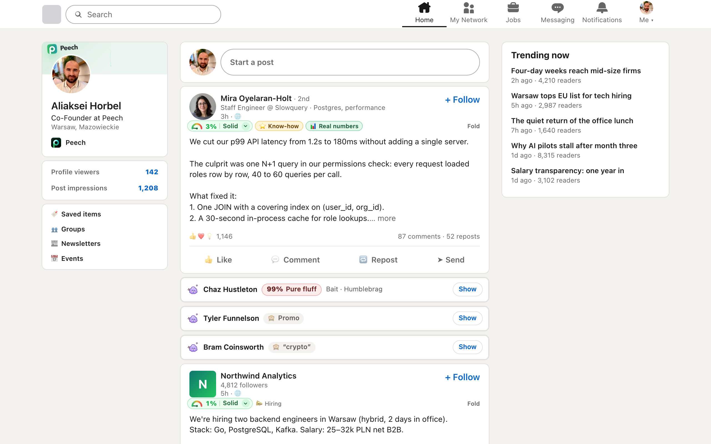
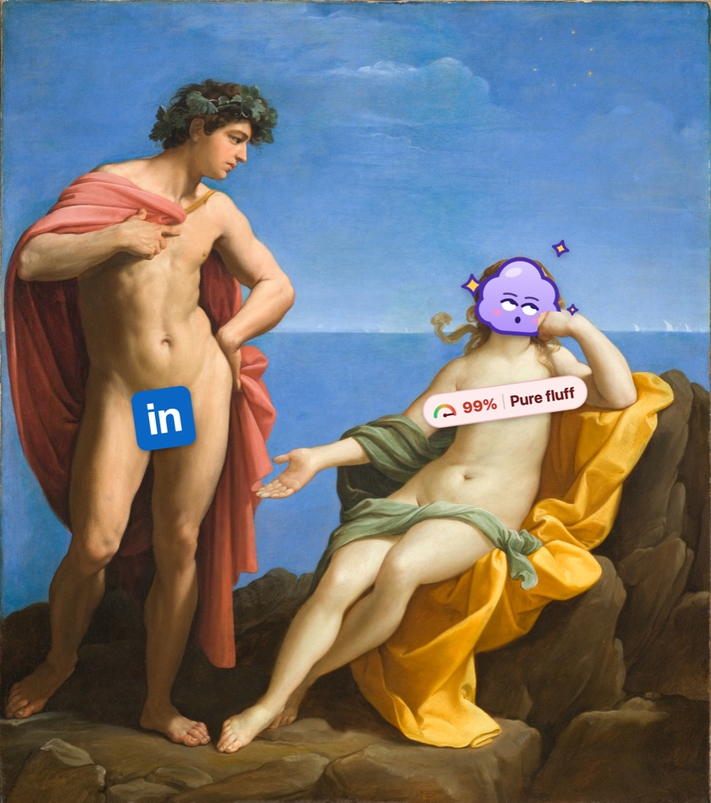

<div align="center">


# Fluff Meter

**Rates every LinkedIn post on a 0–100% Fluff Index and folds what you don't want to read.**

**[Add to Chrome](https://chromewebstore.google.com/detail/fluff-meter-for-linkedin/ijfddippbjffofanjhmnfikabkkeeckj)** · free · open source · collects nothing

[](https://github.com/horbel/fluff-meter/actions/workflows/ci.yml)
[](LICENSE)
[](https://buymeacoffee.com/horbel)



<sub>A feed with Fluff Meter on: the fix with real numbers stays open, fluff, promo and crypto fold to one line each. Every post and person but the author's own profile is made up.</sub>

</div>

Scroll LinkedIn as usual. Every post gets a small badge that tells you:

- **how much fluff it is**, from ☀️ *Solid* to ☁️ *Pure fluff*;
- **which clichés it leans on**: engagement bait ("Agree? 👇", "comment GUIDE"), humblebrags,
  too-neat fables with a janitor in them, truisms, hustle, broetry;
- **what it is about**: know-how, news, hiring, career moves, thank-yous, events, promo…
- **whether it has 📊 real numbers**: metrics, benchmarks, results. Those never fold for fluff.

Pure fluff folds into one line, so you skip it in a second. Click the line to open it again, or
fold any post yourself with **Fold**. The popup shows how much of your feed was fluff and how many
posts it folded for you.

It reads the text of a post, and of the post it reshares. Images, videos and the text inside them
are not analyzed.

Posts about a loss, a war or an illness never get a score. It rates posts, not people.

## Install

**[Get it from the Chrome Web Store](https://chromewebstore.google.com/detail/fluff-meter-for-linkedin/ijfddippbjffofanjhmnfikabkkeeckj)**, then open LinkedIn. It works in Chrome, Edge,
Brave, Arc and other Chromium browsers.

It starts in **demo mode** with random numbers, so you can see how it looks. For real scores,
click the extension icon and paste a [TypeSafe](https://console.typesafe.ai/keys) or
[OpenRouter](https://openrouter.ai/settings/keys) API key. $1 covers about 12,000 posts.

<details>
<summary>Install from GitHub instead</summary>

1. Download the zip from the [latest release](https://github.com/horbel/fluff-meter/releases/latest)
   and unzip it.
2. Open `chrome://extensions`, turn on **Developer mode**, click **Load unpacked** and pick the
   unzipped folder.
3. Open LinkedIn.

This version doesn't update itself; the Web Store one does.
</details>

## Make it yours


Clichés annoy everyone, so they set the score. What a post is about is your call:

- **Categories:** mark each one ⭐ *want* or 🙈 *fold*. Starred posts get a ⭐ chip, folded ones
  shrink to one line. Or pick a preset: **Engineer**, **Recruiter** or **Job seeker**.
- **Your topics:** add up to three of your own, like *Rust* or *crypto*, and star or fold them.
- **Clichés:** switch any of them off and it no longer shows or counts.
- **Folding:** pure fluff only (the default), fluffy posts too, or never.

## Privacy

Fluff Meter collects nothing. There is no server of ours, no account and no analytics in the
extension.

- Your API key, settings and feed stats stay on your device, in Chrome's local storage. They are
  never synced, and LinkedIn's page can't read them.
- Without a key, nothing leaves your browser.
- With a key, the text of the posts you scroll past (and your topics, if you added any) goes
  straight to the AI provider you picked, and nowhere else.

[Details](PRIVACY.md).

<br clear="right" />

## Meet the cloud

The icon is a cloud of fluff that has read one post too many. The lilac and the attitude come from
Lumpy Space Princess in *Adventure Time*. The pose comes from Ariadne in Guido Reni's *Bacchus and
Ariadne*: head on her hand, eyes to the sky, clearly done with this conversation.



<sub>After Guido Reni, <i>Bacchus and Ariadne</i> (c. 1619–20), LACMA. The painting is public domain.</sub>

## Share it

Know someone whose feed needs this? Send them the Web Store link:

```
https://chromewebstore.google.com/detail/fluff-meter-for-linkedin/ijfddippbjffofanjhmnfikabkkeeckj
```

Developers can have the code instead: https://github.com/horbel/fluff-meter

## For developers

- [How it works](docs/how-it-works.md): the model, the scoring and the code layout.
- [Contributing](CONTRIBUTING.md): setup, tests and where to fix things when LinkedIn changes.
- [Chrome Web Store listing](docs/chrome-web-store.md): texts and answers for publishing.

Scores come from [Jev](https://docs.typesafe.ai/concepts/system-one), a small, fast model by
TypeSafe that answers yes/no and multiple-choice questions instead of writing text.

## Support

If it made you laugh at your feed, [buy me a coffee ☕](https://buymeacoffee.com/horbel).

## License

[MIT](LICENSE). Not affiliated with LinkedIn or TypeSafe.
